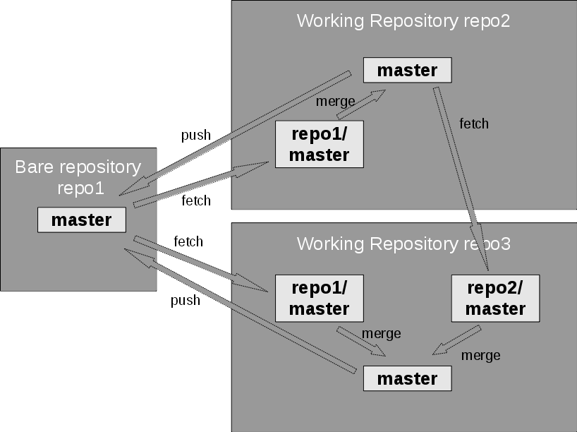

# GitHub / Visual Studio Code Extension

## Übersicht und Prinzip

GitHub ist eine Plattform zur Verwaltung und Zusammenarbeit an Softwareprojekten. Sie baut auf dem Versionskontrollsystem Git auf und erweitert es um Funktionen für Teamarbeit, Projektorganisation und Automatisierung.

Mit GitHub können Entwickler ihren Code online speichern, Änderungen nachverfolgen und gemeinsam an Projekten arbeiten. 
Wichtige Funktionen sind 
* Pull Requests (für Code-Reviews und Diskussionen), 
* Issues (zur Aufgaben- und Fehlerverwaltung) sowie 
* GitHub Actions (für automatisierte Workflows wie Tests und Deployments).

Besonders in der Open-Source-Community ist GitHub weit verbreitet, da es Entwickler weltweit ermöglicht, unkompliziert zusammenzuarbeiten. Auch Unternehmen nutzen GitHub, um ihre Projekte transparent und effizient zu entwickeln.

Was ist der Zusammenhang zwischen GitHub, Git und GitLab?


| Aspekt         | Git                       | GitHub                                | GitLab                                       |
| -------------- | ------------------------- | ------------------------------------- | -------------------------------------------- |
| **Art**        | Versionskontrollsystem    | Hosting-Plattform                     | Hosting-Plattform                            |
| **Betrieb**    | Lokal, dezentral          | Microsoft (Cloud)                     | GitLab Inc. (Cloud & Self-hosted)            |
| **Fokus**      | Versionierung & Branching | Kollaboration, Open Source, Community | Kollaboration, DevOps, Self-Hosting          |
| **CI/CD**      | Nicht enthalten           | GitHub Actions                        | Integriert (sehr stark)                      |
| **Zielgruppe** | Entwickler allgemein      | Vor allem Open-Source & Unternehmen   | Unternehmen mit Fokus auf DevOps & Kontrolle |

Git = das Werkzeug zum Versionsmanagement.
GitHub = Online-Service, um Git-Repos mit Community-Features zu hosten.
GitLab = Alternative zu GitHub, oft im Unternehmenskontext genutzt, mit starkem Fokus auf DevOps und Self-Hosting.


Übersicht über das Grund-Prinzip:


Quelle: https://developer.ibm.com/tutorials/d-learn-workings-git/

Im Rahmen dieses Kurses spielen wir anhand von Modellanpassungen an einer INTERLIS Modelldatei die Haupt-Anwendungsfälle mittels Visual Studio Code durch.

## Visual Studio Code

Visual Studio Code (VS Code / VSC) ist ein kostenloser, plattformunabhängiger Code-Editor von Microsoft. Er unterstützt viele Programmiersprachen direkt oder über Erweiterungen und bietet Funktionen wie Syntax-Highlighting, IntelliSense (automatische Code-Vervollständigung), Debugging und eine enge Integration mit Git und GitHub.

Dank seiner großen Auswahl an Erweiterungen und Themes lässt sich VS Code individuell anpassen und eignet sich sowohl für kleine Projekte als auch für professionelle Softwareentwicklung.

Im Rahmen dieses Kurses betrachten wir die Erweiterungen
* INTERLIS 2 (https://marketplace.visualstudio.com/items?itemName=geowerkstatt.InterlisLanguageSupport)
* sowie das in VSC integrierte Werkzeug "Source control"


## Beispiel-Anwendungsschritte

### 1. Ein Repository klonen

Zweck: Eine lokale Ablage des Remote-Repositories anlegen

Vorgehen:

1. Öffne VSC ohne die Angabe einer Datei oder eines Verzeichnisses und öffne Source Control
2. Du hast nun die Möglichkeit, ein Repsoitory zu klonen: 
3. Trage als URL https://github.com/agiktsh/beispiel_repository.git ein
4. Setze ein lokales Verzeichnis in welches die Dateien des remote Repositories kopiert werden sollen (Repsoitory Destination)

Hinweis:
Das lokal angelegte Verzeichnis ist ein gewöhnliches Verzeichnis und umfasst lediglich noch ein (versteckter) .git Ordner. Er enthält alle Informationen, die Git benötigt, um die Versionsverwaltung zu ermöglichen.

### 2. Lokales Repository mit VSC öffnen / Workspace Datei anlegen

Zweck: Zugriff auf lokales Repository und Projektdatei erstellen

Vorgehen:

1. Öffne VSC und dann das Verzeichnis mit Deinem lokalen Repository
2. Prüfe unter dem Source Control Widget, dass VSC das Verzeichnis als versionskontrolliertes Verzeichnis erkennt
3. Speichere dieses Projekt als neuer Workspace über das Kontextmenu 'Datei'

### 3. Eine .gitignore-Datei anlegen

Zweck: Wir lernen, wie spezifische Dateien von der Versionskontrolle ausgeschlossen werden können

Vorgehen:

1. Wechsle ins Widget Source Control
2. Die vorher angelegte Workspace-Datei (```.code-workspace```) wird als veränderte Datei angezeigt (U: Untracked)
3. Da wird diese selbst nicht in die Code-Verwaltung aufnehmen wollen, soll sie ignriert werden. Selektiere sie dazu und wähle über die rechte Maustaste ```'Add to .gitignore'```
4. Die Datei verschwindet nun aus der Liste der veränderten Dateien

### 4. Neuer Ordner und Dateien anlegen

Zweck: Neue Elemente in die Code-Verwaltung aufnehmen

Vorgehen:

1. Lege über den Explorer einen neuen Ordner namens ```config``` an
2. Lege anschliessend innerhalb dieses Ordners eine neue Datei mit dem Namen ```valid.config```
3. Kontrolle in 'Source control' die durch Git festgestellten Änderungen im lokalen Repo

### 5. Änderungen committen

Zweck: Die bis anhin erstellten Änderungen festschreiben

Vorgehen:

1. Wechsle in 'Source control' 
2. Trage als Commit Message 'initiale Anpassungen vornehmen' oder etwas Ähnliches ein
3. Schreibe diese Änderungen nun mittels Commit im lokalen Repository fest

Hinweis:
Für Commit Messages wird typischerweise der Imperativ-Stil verwendet und es wird beschrieben, was gemacht wurde und nicht wie oder warum es gemacht wurde.
✅ Add feature X
❌ Added feature X
❌ Adding feature X
Die dabei eingesetzte Sprache soll sich an der Repository-Sprache orientieren. 

### 6. Änderungen pushen

Zweck: Die Änderungen im lokalen Repository ins remote Repository schreiben

Vorgehen:


## Begriffe

| Begriff        | Bedeutung                 | 
| -------------- | ------------------------- | 
| Klonen        |     | 
| Branch        |     | 
| Commit        |     | 
| Merge        |     | 

## Erweiterte Aspekte

### Konfliktmanagement

### GitHub Actions